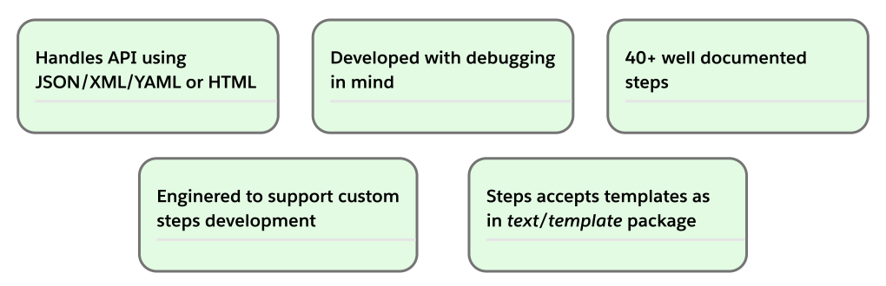

# Godog framework developed to test HTTP(s) API.

## Overview:

This repository contains skeleton that allow to write tests for HTTP(s) API using [godog](https://github.com/cucumber/godog)
that implements 🥒[cucumber/gherkin](https://cucumber.io/docs/gherkin/) syntax with help of [gdutils](https://github.com/pawelWritesCode/gdutils) lib.



## Why ?
This project **shorten initial development phase** and allows to quickly bootstrap e2e test framework with **plenty of
utility methods**. Just grab it and write tests right away using provided steps!

## [Quickstart](https://pawelwritescode.github.io/godog-http-api.documentation/docs/prologue/quick-start/)
**Note**: Some users may require to run some commands with `sudo`
```shell
git clone https://github.com/pawelWritesCode/godog-http-api.git && cd godog-http-api
make all
```
Afterwards you can run tests using 3 distinct ways
```shell
make tests-using-host
make tests-using-docker
make tests-using-compose
```

## Documentation

For more details and explanations see documentation [page](https://pawelwritescode.github.io/godog-http-api.documentation/).

## Example

#### [👆 Click here](https://github.com/pawelWritesCode/godog-http-api/blob/main/features) to see more tests using JSON/YAML/XML.

```cucumber
Feature: Adding new user
  Web server binary and it's documentation can be found in assets/test_server/ dir.
  Server contains following endpoints:
  - GET     /alive                  - healthcheck
  - POST    /users                  - creates new user
  - GET     /users                  - retrieve all users
  - GET     /users/{user_id}        - retrieve user by user_id
  - PUT     /users/{user_id}        - replace user by user_id
  - DELETE  /users/{user_id}        - delete user by user_id
  - POST    /users/{user_id}/avatar - add avatar for user of user_id

  Background:
  This section runs before every Scenario. Its main purpose is to generate random user data
  and save it under provided key in scenario cache.

    Given I generate a random word having from "5" to "10" of "ASCII" characters and save it as "RANDOM_FIRST_NAME"
    Given I generate a random word having from "3" to "7" of "UNICODE" characters and save it as "RANDOM_LAST_NAME"
    Given I generate a random sentence having from "3" to "4" of "english" words and save it as "RANDOM_DESCRIPTION"
    Given I generate a random "int" in the range from "18" to "20" and save it as "RANDOM_AGE"
    Given I generate current time and travel "backward" "240h" in time and save it as "MEET_DATE"
    Given I save "application/json" as "CONTENT_TYPE_JSON"

  Scenario: Successfully create user v1
  As application user
  I would like to create new account

    #---------------------------------------------------------------------------------------------------
    # We send HTTP(s) request using pre-generated data to create new user.
    # Accessing saved data from scenario cache is done through template syntax from text/template package.
    # Docstring may be in YAML or JSON format and should have "body" and "headers" keys.
    When I send "POST" request to "{{.MY_APP_URL}}/users?format=json" with body and headers:
    """
    {
        "body": {
            "firstName": "{{.RANDOM_FIRST_NAME}}",
            "lastName": "doe-{{.RANDOM_LAST_NAME}}",
            "age": {{.RANDOM_AGE}},
            "description": "{{.RANDOM_DESCRIPTION}}",
            "friendSince": "{{.MEET_DATE.Format `2006-01-02T15:04:05Z`}}"
        },
        "headers": {
            "Content-Type": "{{.CONTENT_TYPE_JSON}}"
        }
    }
    """
    Then the response status code should not be 200
    But the response status code should be 201
    And the response should not have header "Set-Cookie"
    But the response should have header "Content-Length"
    And the response should have header "Content-Type" of value "{{.CONTENT_TYPE_JSON}}; charset=UTF-8"
    And the response body should not have format "plain text"
    But the response body should have format "JSON"
    And time between last request and response should be less than or equal to "2s"

    # uncommenting next line will print data to console
#    Given I print last response body
#    Given I print cache data

    # This waiting is unnecessary, just added for demonstration
    And I wait "2ms"

    #---------------------------------------------------------------------------------------------------
    # We validate response body with schema from assets/test_server/doc/schema/user/response/user.json
    # step argument may be: relative|full OS path, URL or raw schema definition
    # relativity is obtained through env variable GODOG_JSON_SCHEMA_DIR
    And the response body should be valid according to schema "user/response/user.json"
    And the response body should be valid according to schema "{{.CWD}}/assets/test_server/doc/schema/user/response/user.json"
    And the response body should be valid according to schema "https://raw.githubusercontent.com/pawelWritesCode/godog-http-api/main/assets/test_server/doc/schema/user/response/user.json"
    And the response body should be valid according to schema:
    """
    {
        "title": "create user",
        "description": "Valid response from create user endpoint",
        "type": "object"
    }
    """
    # also nodes may be validated against schema
    And the "JSON" node "firstName" should be valid according to schema:
    """
    {
        "title": "first name",
        "type": "string"
    }
    """
    # querying JSON nodes in any step may be done using three different json-path engines
    # tidwall/gjson or oliveagle/jsonpath or antchfx/jsonquery
    And the "JSON" node "firstName" should be "string" of value "{{.RANDOM_FIRST_NAME}}"
    And the "JSON" node "$.lastName" should be "string" of value "doe-{{.RANDOM_LAST_NAME}}"
    And the "JSON" node "//lastName" should be "string" of value "doe-{{.RANDOM_LAST_NAME}}"

    # you can look for substrings
    And the "JSON" node "$.lastName" should not contain sub string "smith"
    But the "JSON" node "lastName" should contain sub string "doe"

    # this step uses regExp acceptable by standard go package "regExp"
    And the "JSON" node "lastName" should not match regExp "smith-.*"
    But the "JSON" node "//lastName" should match regExp "doe-.*"

    # assertion may be based on one of JSON data types: array, boolean, null, number, object
    And the "JSON" node "age" should not be "string"
    But the "JSON" node "$.age" should be "number"
    And the "JSON" node "$.age" should be "number" and contain one of values "18, 19, 20"

    # assertion may be based on one of Go-like data types: bool, float, int, map, slice, string
    But the "JSON" node "$.age" should be "int"
    And the "JSON" node "age" should be "int" of value "{{.RANDOM_AGE}}"
    And the "JSON" node "description" should be "string" of value "{{.RANDOM_DESCRIPTION}}"

    # date can be formatted according to one of available formats from standard go package "time"
    And the "JSON" node "friendSince" should be "string" of value "{{.MEET_DATE.Format `2006-01-02T15:04:05Z`}}"

```

## [Available steps](https://github.com/pawelWritesCode/godog-http-api/blob/main/main_test.go#L74)


